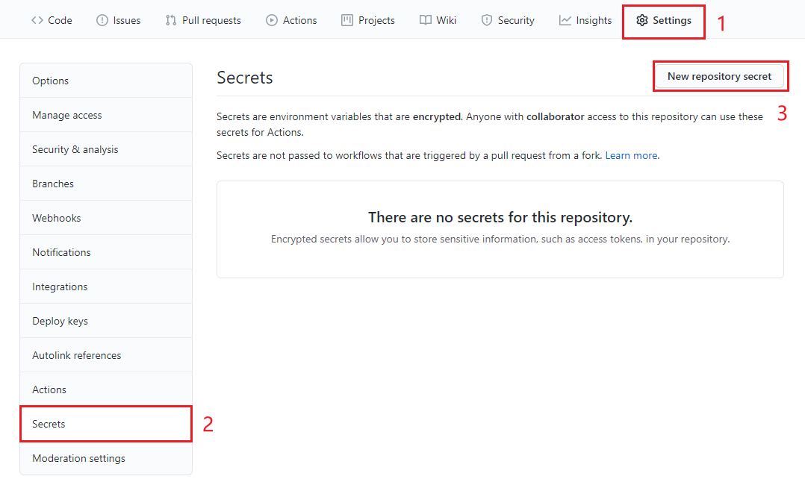
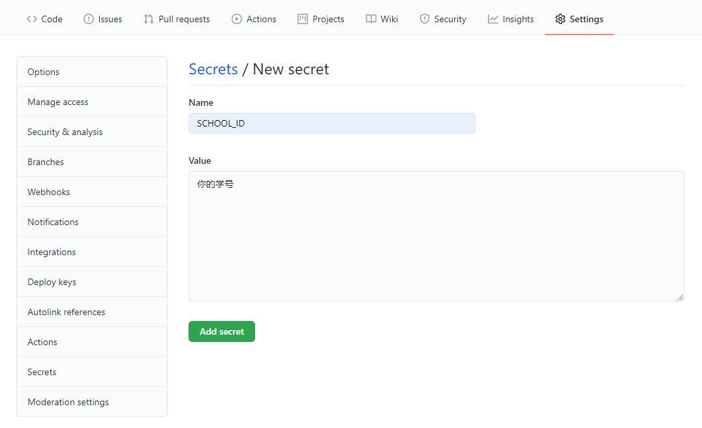
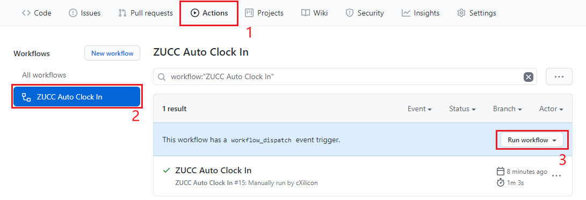

# ZUCC-Daily-Helper

### 浙大城市学院每日自动健康打卡

#### 配置：

1. fork 该仓库
2. 点击仓库中的 `Setting` 标签，选中 `Secrets`
3. 选中 `New repository secret` 新建两个环境变量

      `Name`: SCHOOL_ID `Value`: 学号

      `Name`: PASSWORD `Value`: 统一身份认证密码

#### 使用:

程序将在每天 7 点自动运行，也可以在 `Aciton` 中手动触发运行

